# NVIDIA GPU 設置指南

挑戰難度：★★★★☆

## 步驟 1. 檢查 CUDA 版本與 GeForce 驅動程式

在安裝或驗證 CUDA 之前，請先檢查系統中是否已安裝 CUDA 版本和 GeForce 驅動程式。

### 方法 1. 用 nvidia-smi 指令
開啟 CMD (命令提示符) 或 PowerShell，輸入執行指令：
```
nvidia-smi
```
顯示這台 PC 的 GPU 相關資料，可判斷安裝 CUDA Toolkit 的相容版本。
> 以下圖為例，外部顯卡型號是 GeForece RTX 3060，CUDA 版本是 12.7，表示 NVIDIA 顯示卡驅動能夠最高支援 CUDA Runtime 12.7。<br>
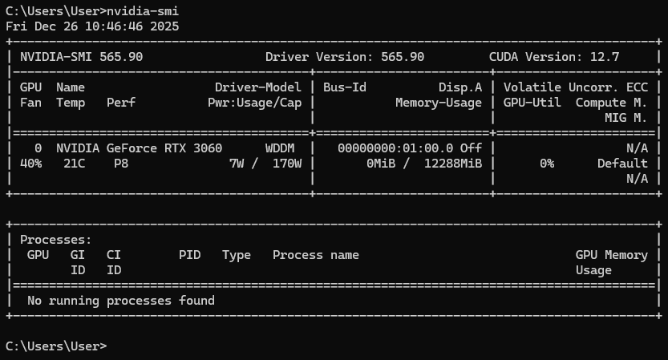

> GPU 驅動程式版本 565.90。`nvidia-smi` 無法正常顯示的話，可能是沒安裝好 GPU Driver。官網：https://www.nvidia.com/zh-tw/geforce/drivers/ 。

### 方法 2. 用 nvcc 指令
如果已成功安裝 CUDA Toolkit (有設定 PATH，並重啟 PC 之後)，開啟 CMD (命令提示符) 可執行：
```
nvcc --version
```
顯示 CUDA 編譯器版本。
> 以下圖為例，CUDA 編譯器版本。<br>
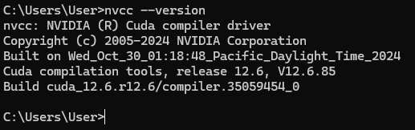

## 步驟 2. 下載並安裝 CUDA Toolkit
> CUDA Toolkit 版本 ≤ `nvidia-smi` 顯示的 CUDA 版本。建議選用最新且穩定版本的 CUDA Toolkit。

1. 前往 NVIDIA 官方下載頁面：https://developer.nvidia.com/cuda-toolkit-archive
    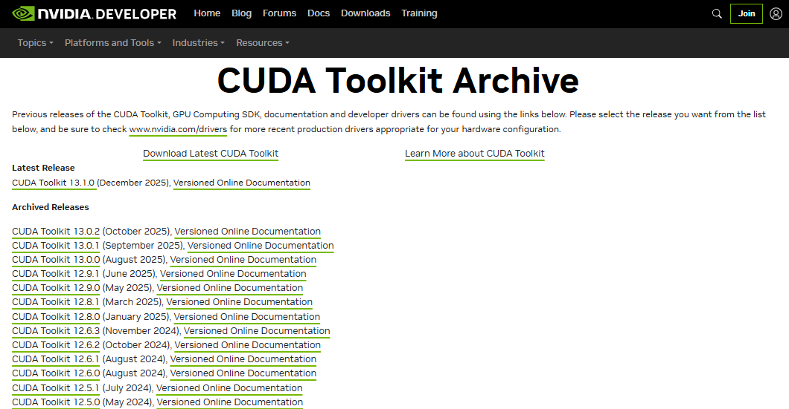

2. 點擊合適的 Toolkit 版本，選擇作業系統 (如 Windows)、系統架構 (x86_64)、版本 (Win11)、安裝類型 (exe(local))。<br>
    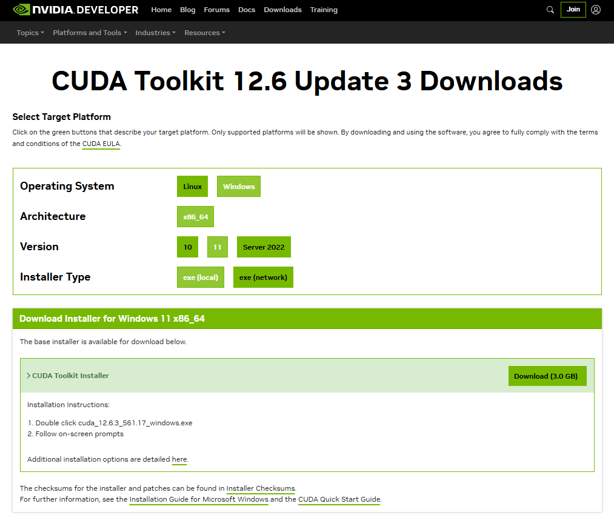<br>
3. 下載後執行 `cuda_12.6.3_561.17_windows.exe`，初次安裝會自動產生 `C:\Program Files\Nvidia GPU Computing Toolkit\*`、`C:\Program Files\NVIDIA Corporation\*` 兩個目錄。<br>
    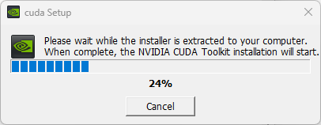<br>
    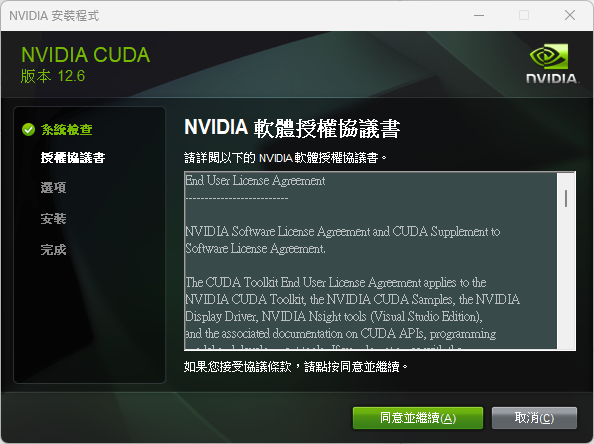<br>
    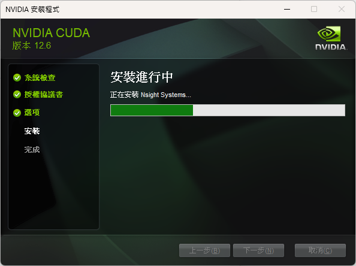<br>
    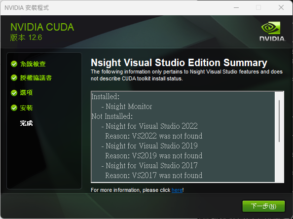<br>
    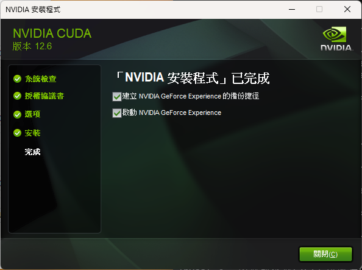<br>

4. 檢查環境變數，通常會自動加入 `CUDA_PATH`、`CUDA_PATH_V12_6` 都指向 `C:\Program Files\NVIDIA GPU Computing Toolkit\CUDA\v12.6`。(設置完畢，要重啟開機)<br>
    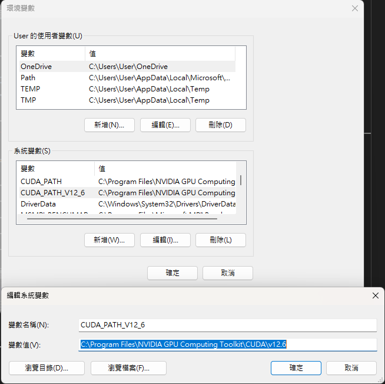<br>
    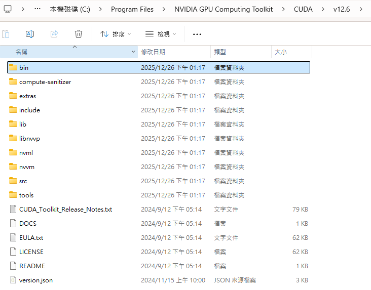<br>

> 注意！如果安裝了錯誤或不相容的版本，可到「應用程式」解除安裝，並刪除此 Toolkit 版本的環境變數。<br>
> 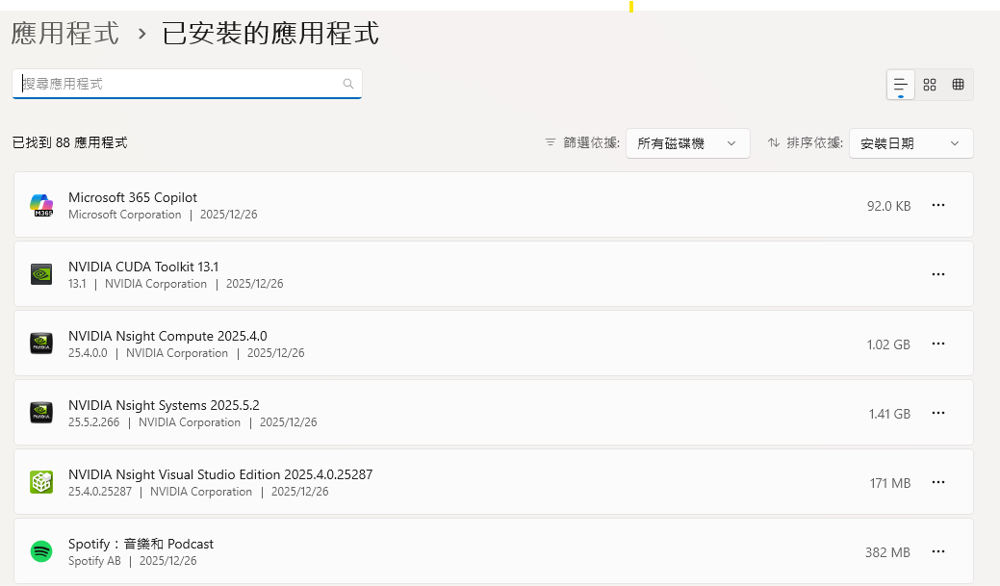

## 步驟 3. 下載並安裝 cuDNN
> 選擇 cuDNN 時，要對應的是「已安裝 CUDA Toolkit 版本」，不是看 `nvidia-smi` 顯示的 CUDA 版本。
1. 閱讀 NVIDIA 最新釋出的官方文件，確認當前 PC 的 Toolkit 版本是否有最新可用的 cuDNN。
    - Support Matrix - GPU, CUDA Toolkit, and CUDA Driver Requirements：https://docs.nvidia.com/deeplearning/cudnn/backend/latest/reference/support-matrix.html
2. 登入帳號，並點開 NVIDIA cuDNN 的下載頁面：https://developer.nvidia.com/rdp/cudnn-archive
    > 注意！必須先完成免費註冊，並登入 NVIDIA 開發者帳戶，否則網頁上只會顯示 exe 的連結，完全不會跳出實際需要的 zip。<br>
    >【成功案例-取得 zip】<br>
    >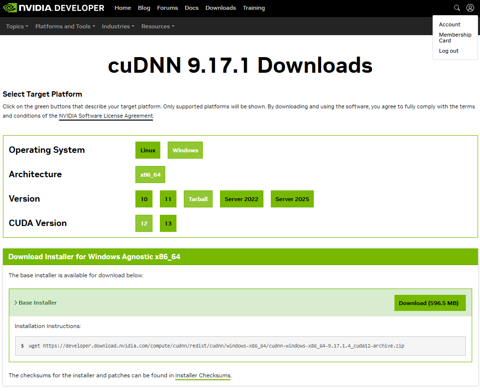<br><br>
    >【失敗案例-取得 exe】<br>
    >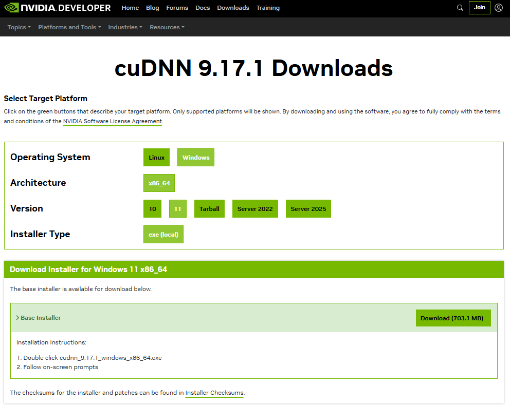<br>
    >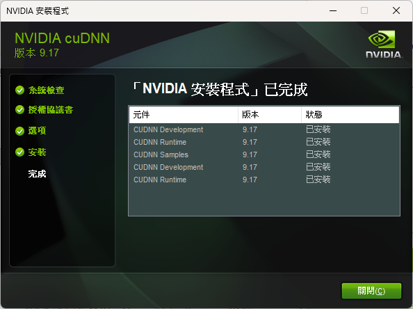

3. 複製檔案是從 zip 解壓縮的 cuDNN  `cudnn-windows-x86_64-9.17.1.4_cuda12-archive.zip` 中取得，共有 3 個目錄 + 1 個檔案，手動覆蓋到對應的 CUDA 目錄：<br>
    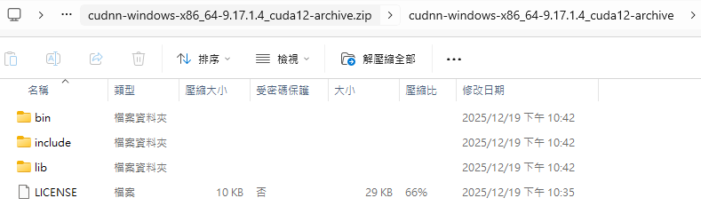<br>
    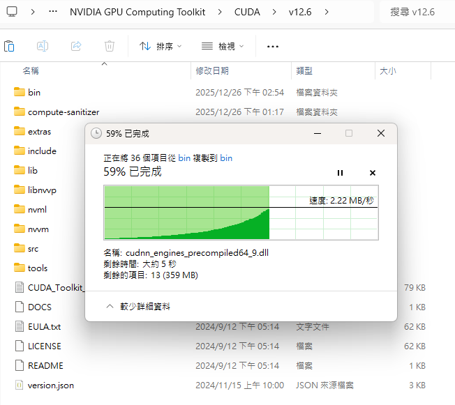<br>

- `bin\cudnn*.dll` → `C:\Program Files\Nvidia GPU Computing Toolkit\CUDA\vXX.X\bin\`
- `include\cudnn*.h` → `C:\Program Files\Nvidia GPU Computing Toolkit\CUDA\vXX.X\include\`
- `lib\x64\cudnn*.lib` → `C:\Program Files\Nvidia GPU Computing Toolkit\CUDA\vXX.X\lib\x64\`

## 步驟 4. 檢查 cuDNN 是否可執行

### 檢查 1. cuDNN 是否存在？
- 查看 CUDA 目錄 `C:\Program Files\NVIDIA GPU Computing Toolkit\CUDA\v12.6` 下方，確認是否有這些檔案：
    ```
    bin\cudnn*.dll
    include\cudnn*.h
    lib\x64\cudnn*.lib
    ```
### 檢查 2. 檢查 DLL 是否能被系統載入？
- 在 CMD 輸入 WHERE 指令，顯示 `C:\Program Files\NVIDIA GPU Computing Toolkit\CUDA\v12.6\bin\cudnn64_9.dll`。
    ```
    where cudnn64_9.dll
    ```

### 檢查 3. 執行 py 腳本驗證 GPU 是否運作？
1. 安裝 Anaconda，建立並啟動 env。
2. 下載 PyTorch 套件。
    > 注意！**安裝 PyTorch GPU 版本時，必須依官方支援的 CUDA 版本為準，而不是看已安裝 CUDA Toolkit 版本。** 由於 PyTorch 2.1 官方提供的是 CUDA 12.1 / 12.2 已編譯套件版本 (wheel、conda package)，故這邊指定 pytorch-cuda=12.1 作為穩定版本，而非 12.6。
    ```
    (ttst) D:\YOLO_envs\ttst> conda install pytorch torchvision torchaudio pytorch-cuda=12.1 -c pytorch -c nvidia
    ```
3. 建立 .py 腳本，並在 VSCode 嘗試執行 code。
    ```
    import torch

    # 查看 CUDA 是否可用
    print(torch.cuda.is_available())

    # 查看 GPU 名稱
    if torch.cuda.is_available():
        print(torch.__version__)                # PyTorch 版本
        print(torch.version.cuda)               # CUDA 版本
        print(torch.backends.cudnn.version())   # cuDNN 版本
        print(torch.cuda.is_available())        # 是否可以用 GPU
        print(torch.cuda.get_device_name(0))    # GPU 名稱
    ```
    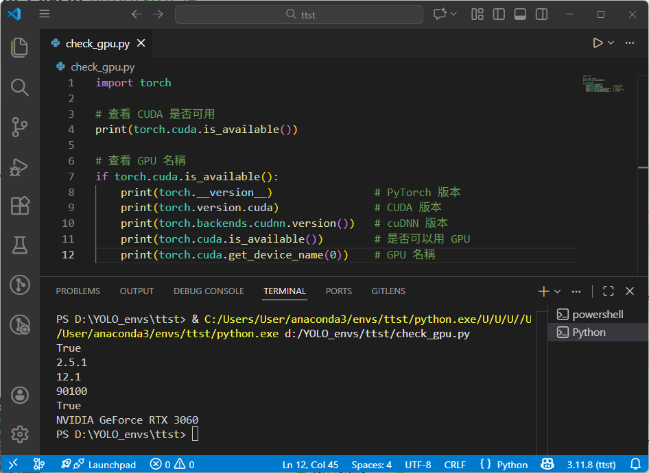<br>

> 
> 若是採用 tf 的專案，也可嘗試：import tensorflow as tf，取得 tf.config.list_physical_devices('GPU')。

## 閱讀資源
- NVIDIA cuDNN Installation Guide：https://docs.nvidia.com/deeplearning/cudnn/installation/latest/
- CUDA Installation Guide for Microsoft Windows：https://docs.nvidia.com/cuda/cuda-installation-guide-microsoft-windows/