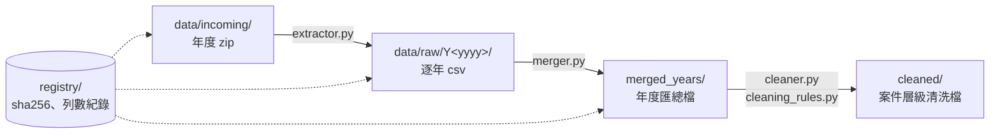

# 交通事故嚴重程度預測與高風險情境分析 🚗🛞

## 1. 專案概述 📌

這個專案使用台灣歷年交通事故的公開資料，資料欄位包括天候、光線、道路型態、號誌、肇因、當事者屬性和經緯度等，實作歸檔管理、機器學習和可視化 pipeline。

**做了什麼**
- 資料管理：把逐年公開的 zip 依序解壓縮、合併成年度匯總檔、清洗後歸檔。每個步驟都用 sha256 記錄處理狀態，避免重複處理。
- 嚴重程度模型：用 Logistic 迴歸預測一件事故是 A1（死亡）還是 A2（受傷），並把係數換算成勝算比，找出高風險情境。
- 版本管理：訓練、評估、登錄採用版本三個步驟分開執行，每次訓練的設定和指標都留有紀錄。

**主要技術**

| 類別 | 技術 |
| --- | --- |
| 語言 / 環境 | Python 3.12、Anaconda（conda-forge） |
| 資料處理 | pandas |
| 機器學習 | scikit-learn（LogisticRegression、PoissonRegressor (todo)、One-Hot 編碼、互資訊特徵篩選）、joblib |
| 可視化 (todo) | matplotlib、seaborn |
| 版本追蹤 | sha256 處理紀錄（`registry/*.json`）、訓練紀錄（`models/metadata.json`）、採用版本登錄（`registry/manifest.json`） |

### 原始資料來源 💾

| 資料集名稱 | 檔案類型 | 初次上架日 | 備註 |
| --- | --- | --- | --- |
| [109年傷亡道路交通事故資料](https://data.gov.tw/dataset/158864) | 單一zip打包多個csv | 2022-10-13 | |
| [110年傷亡道路交通事故資料](https://data.gov.tw/dataset/158865) | 單一zip打包多個csv | 2022-10-13 | |
| [111年傷亡道路交通事故資料](https://data.gov.tw/dataset/161199) | 單一zip打包多個csv | 2023-03-08 | |
| [112年傷亡道路交通事故資料](https://data.gov.tw/dataset/167905) | 單一zip打包多個csv | 2024-03-04 | |
| [113年傷亡道路交通事故資料](https://data.gov.tw/dataset/172969) | 單一zip打包多個csv | 2025-03-03 | |
| [114年傷亡道路交通事故資料](https://data.gov.tw/dataset/177136) | 單一zip打包多個csv | 2026-03-06 | |
| [即時交通事故資料 (A1類)(json格式)](https://data.gov.tw/dataset/57023) | json | 2017-10-17 | 持續更新，僅列當年度 |
| [即時交通事故資料 (A2類)(json格式)](https://data.gov.tw/dataset/57024) | 單一zip打包單一json | 2017-10-17 | 持續更新，僅列當年度 |

> 台灣交通事故等級判定
> - A1 類：造成人員當場或 24 小時內死亡之交通事故。
> - A2 類：造成人員受傷或超過 24 小時死亡之交通事故。
> - A3 類：指僅有車輛財物受損之交通事故。(由於資料不完整，故本專案暫不列入)

<details>
<summary><b>A1 類/ A2 類交通事故的資料欄位 (50 欄)</b></summary>

**時間資訊**
發生年度、發生月份、發生日期、發生時間

**事故基本資訊**
事故類別名稱、處理單位名稱警局層、發生地點、事故類型及型態大類別名稱、事故類型及型態子類別名稱、肇事逃逸類別名稱-是否肇逃

**環境條件**
天候名稱、光線名稱

**道路與交通設施**
道路類別-第1當事者-名稱、速限-第1當事者、道路型態大類別名稱、道路型態子類別名稱、事故位置大類別名稱、事故位置子類別名稱、路面狀況-路面鋪裝名稱、路面狀況-路面狀態名稱、路面狀況-路面缺陷名稱、道路障礙-障礙物名稱、道路障礙-視距品質名稱、道路障礙-視距名稱、號誌-號誌種類名稱、號誌-號誌動作名稱、車道劃分設施-分向設施大類別名稱、車道劃分設施-分向設施子類別名稱、車道劃分設施-分道設施-快車道或一般車道間名稱、車道劃分設施-分道設施-快慢車道間名稱、車道劃分設施-分道設施-路面邊線名稱

**肇因研判**
肇因研判大類別名稱-主要、肇因研判子類別名稱-主要、肇因研判大類別名稱-個別、肇因研判子類別名稱-個別

**當事者屬性與行為**
當事者順位、當事者區分-類別-大類別名稱-車種、當事者區分-類別-子類別名稱-車種、當事者屬-性-別名稱、當事者事故發生時年齡、保護裝備名稱、行動電話或電腦或其他相類功能裝置名稱、當事者行動狀態大類別名稱、當事者行動狀態子類別名稱、車輛撞擊部位大類別名稱-最初、車輛撞擊部位子類別名稱-最初、車輛撞擊部位大類別名稱-其他、車輛撞擊部位子類別名稱-其他

**傷亡結果與地理位置**
死亡受傷人數、經度、緯度

</details>

## 2. 問題與動機 🎯

**為什麼要做**
- **找出高風險情境**：同樣是交通事故，有些會造成死亡（A1），大多數只有受傷（A2）。這個專案想知道天候、光線、道路型態、號誌、時段等條件中，哪些會明顯提高事故變成 A1 的機會，作為交通安全改善的參考。
- **練習完整的 ML 流程**：不只訓練一個模型，而是從公開資料下載、清洗、特徵篩選、建模、評估，一路做到版本登錄和對外提供模型。

**原本的痛點**
- 公開資料按年度分開發布，每年是一個 zip 包多個 csv，而且每個 csv 檔尾都有說明註解列，無法直接合併分析。
- 原始資料每一列是一位當事者，不是一件事故，要先整理成案件層級才能建模。
- 資料每年都會新增；如果每次都從頭重跑，很難知道哪些年度處理過、清洗規則改了之後哪些要重做，也很難確認清洗過程有沒有漏掉資料。
- A1 只占約 0.5%，全部猜 A2 就有 99.5% 準確率，所以準確率不能拿來判斷模型好壞。

## 3. 解決方案 💡

1. **可重複、可追溯的資料 pipeline**：解壓縮、合併、清洗分成三支程式，每一步都把來源檔的 sha256 記錄在 `registry/`，來源沒有變就略過。清洗規則有修改時用 `--force` 指定年度重做，並用列數等式驗證沒有資料遺漏或重複。
2. **可解釋的線性模型**：不追求黑箱模型的分數，改用 Logistic 迴歸（severity）和 Poisson 迴歸（injured_num），把係數換成勝算比或倍率，直接回答「某條件下發生 A1 的勝算是參考類別的幾倍」。
3. **針對不平衡資料的訓練和評估**：訓練集欠採樣，評估改看 PR-AUC、recall、precision、F1、F2，切點從 validate 掃描決定，test 只在版本定案後使用一次。
4. **手動把關的版本管理**：train → evaluate → promote 三步分開執行，每一步都要人工確認，採用版本登錄在 `registry/manifest.json`，之後由 `predictor.py` 作為對外唯一的入口。

## 4. 系統架構 / Workflow 🧭

> 以下皆為手動觸發，暫時沒有排程或自動化機制；每一階段都需要人工確認後才執行下一步。🤚

**① 資料管理（`src/data_management/`）**



**② 訓練與部署（`src/preprocessing/`、`src/training/`、`src/predictor.py`）**


| 元件 | 資料夾 | 職責 |
| --- | --- | --- |
| 資料管理 | `src/data_management/` | 解壓縮、合併、清洗年度資料，記錄處理狀態 |
| 前處理 | `src/preprocessing/` | 載入資料、切分資料集、One-Hot 編碼、組出 X、y |
| 特徵篩選 | `src/features/` | 用互資訊（MI）過濾無關欄位 |
| 訓練與版本管理 | `src/training/` | 訓練、評估、登錄採用版本 |
| 推論 | `src/predictor.py` (todo)| 讀取採用版本，供其他程式 import 使用 |
| 紀錄 | `registry/`、`models/metadata.json` | 處理狀態、訓練紀錄、採用版本 |

### 資料夾架構 📂

```
traffic_accident_ml/
├── data/
│   ├── on_hold/                # 暫不使用的原始 zip，要納入時移到 incoming/
│   ├── incoming/               # 下載、待解壓縮的原始 zip
│   ├── raw/Y<yyyy>/            # extractor.py 解壓縮出的逐年 csv 原始檔
│   └── processed/
│       ├── merged_years/       # merger.py 產出的年度匯總檔
│       └── cleaned/            # cleaner.py 產出的逐年清洗檔
├── registry/
│   ├── extracted_zips.json     # extractor.py 記錄已解壓縮 zip 的 sha256，避免重複解壓
│   ├── merged_years.json       # merger.py 記錄各年度來源檔案的 sha256，避免重複合併
│   ├── cleaned_years.json      # cleaner.py 記錄各年度來源檔 sha256 與清洗前後列數，避免重複清洗
│   └── manifest.json           # promote.py 登錄各 target 目前採用的模型版本
├── models/                     # 訓練產出：模型檔 .joblib、勝算比表 .csv、所有訓練紀錄
├── environment.yml             # conda 環境定義
└── src/
    ├── data_management/
    │   ├── common.py                # 共用工具
    │   ├── extractor.py             # 解壓縮年別 zip
    │   ├── merger.py                # 合併年度彙總檔 csv
    │   ├── cleaner.py               # 清洗後年度匯總檔 csv
    │   └── cleaning_rules.py        # 清洗規則
    ├── preprocessing/
    │   ├── loader.py                # 資料載入、資料集切分(訓練集、訓練子集、驗證集、測試集)
    │   ├── encoding.py              # One-Hot 編碼，明確指定各欄參考類別
    │   └── target.py                # 定義目標 y 與不列入特徵的欄位，組出訓練用 X、y
    ├── features/
    │   └── filter_selection.py      # 互資訊(MI)過濾法篩選欄位
    ├── training/
    │   ├── train.py                 # loader -> One-Hot -> 可解釋線性模型 -> 匯出至 models/
    │   ├── severity_model.py        # [已實作] 分類問題：Logistic 迴歸 → 勝算比
    │   ├── injury_model.py          # [待實作] 迴歸問題：Poisson 迴歸 → 受傷人數倍率
    │   ├── evaluate.py              # 評估指標實作(驗證集、測試集)；版本定案後評估(測試集)
    │   └── promote.py               # 登錄採用版本至 registry/manifest.json
    └── predictor.py                 # [待實作] 對外唯一入口，供其他 py 檔案 import 使用訓練完成的模型
```

## 5. 技術實作 🛠️

### 環境建置

1. 安裝 [Anaconda](https://www.anaconda.com/download) 。
    - 本專案只使用 Anaconda 管理虛擬環境與套件。
    - 安裝完成後可從開始選單開啟 Anaconda Prompt。

2. 開啟 Anaconda Prompt，切換到本專案目錄，依 `environment.yml` 建立並啟動虛擬環境。
    ``` Anaconda Prompt
    (base) D:\your-project\traffic_accident_ml> conda env create -f environment.yml
    (base) D:\your-project\traffic_accident_ml> conda activate traffic_ml
    ```
    - 要點 1：請確認 VSCode 開啟 .py 時，右下角虛擬環境是在 `traffic_ml`。
    - 要點 2：`environment.yml` 的套件全部由 conda-forge 安裝，避免 pip 和 conda 混裝造成的套件衝突。之後若新增套件，請更新 `environment.yml`。
    - 要點 3：若套件有更新，可執行 `conda env update -f environment.yml --prune` 同步環境。
    - 要點 4：切換到本專案目錄只是為了讓 `-f environment.yml` 找得到檔案；也可在任何目錄改用完整路徑，如 `conda env create -f D:\your-project\traffic_accident_ml\environment.yml`。conda 環境統一建立在 Anaconda 的 `envs\traffic_ml`，不會建在專案資料夾內。

3. 所有 py 程式都以模組方式、一定要在 `traffic_accident_ml/` 目錄下方執行。
    ``` Anaconda Prompt
    (traffic_ml) D:\your-project\traffic_accident_ml>python -m src.data_management.cleaner
    ```
    - 若在不正確的位置，讓程式使用相對匯入的話，通常會出現 `ImportError` 或 `ModuleNotFoundError: No module named 'src'` 的報錯。

### 資料前處理
1. 下載並將各年度原始資料 zip 放入 `data/incoming/`。
2. 手動執行 extractor，依年度解壓縮到 `data/raw/Y<年度>/`。
    ``` Anaconda Prompt
    (traffic_ml) D:\your-project\traffic_accident_ml>python -m src.data_management.extractor
    ```
3. 手動執行 merger，將各年度 csv 合併到 `data/processed/merged_years/`。
    ``` Anaconda Prompt
    (traffic_ml) D:\your-project\traffic_accident_ml>python -m src.data_management.merger
    ```
4. 手動執行 cleaner，逐年清洗年度匯總檔，輸出到 `data/processed/cleaned/`，列數記錄於 `registry/cleaned_years.json`。
    ``` Anaconda Prompt
    (traffic_ml) D:\your-project\traffic_accident_ml>python -m src.data_management.cleaner
    ```
    - 不帶參數：逐年檢查，來源檔 sha256 未變更且輸出檔都在的年度會略過(`[skip]`)。
    - 帶參數：`--force yyyy...`：只處理指定的西元年，不論處理狀態一律重新清洗。欄位對照表、編碼對照表中其他年度的列沿用上次結果。
    - 使用時機
        - 只修改 `cleaner.py` 或 `cleaning_rules.py` 的清洗規則時，來源檔不會變更，若只用不帶參數執行會全部略過，這時請用 `--force` 重新清洗。
        - 希望採非連續性的年度執行時，而連續年度資料清洗時，可一次指定多個年度，指令如下：
            ``` Anaconda Prompt
            (traffic_ml) D:\your-project\traffic_accident_ml>python -m src.data_management.cleaner --force 2023 2020 2021
            ```

### 訓練階段
5. 若確認需要重新訓練，手動執行 train。
    - 目前只能訓練：severity (A1=1、A2=0) (`severity_model.py`)。
    - 尚未接入訓練：injured_num (`injury_model.py`)。
    ``` Anaconda Prompt
    (traffic_ml) D:\your-project\traffic_accident_ml>python -m src.training.train
    ```
    **內部依序執行**：
    1. 讀取資料：各年度清洗後資料集，只保留案件層級欄位，並移除互資訊過濾判定無關的 `LOW_MI_COLS`。
    2. 切分資料：依 year × severity 分層切成 train / validate / test(0.7 / 0.2 / 0.1)。
        - 訓練集再欠採樣成多個子集 (A1:A2 = 1:`SAMPLE_FOLD`，預設 1:5)，目前只用第 `SUBSET_INDEX` 個(預設第 0 個)。
        - validate、test 不欠採樣，維持原始比例；test 在這一步不使用，留給 `evaluate.py`。
    3. 訓練模型：One-Hot 編碼規則以完整訓練集決定，邏輯斯迴歸以欠採樣子集配適，並檢查迭代次數是否達 `max_iter` 上限(是否收斂)。
    4. 評估模型：只在 validate 計算 PR-AUC、recall、precision、F1、F2(切點見 `evaluate.THRESHOLD`)，作為比較、挑選版本的依據(見評估階段)。
    5. 輸出結果：存至 `models/`，檔名加上 UTC 時戳(例如 `severity_20260928T122347Z`)，每次訓練不互相覆蓋。
        - 模型檔 `.joblib`：整個 Pipeline(編碼規則 + 模型)，載入後可直接對原始 DataFrame 預測，提供 `evaluate.py`、`predictor.py` 使用。
        - 勝算比表 `_odds_ratio.csv`：每列為一個 One-Hot 類別的係數與勝算比，執行完會印出前 20 名。
        - 訓練紀錄：附加一筆至 `models/metadata.json`(見評估階段)。

    | 目標 | 模型 | 係數解讀 |
    |---|---|---|
    | severity(A1 = 1)[已實作] | `LogisticRegression(max_iter=1000)`(solver=lbfgs，L2 正則化 C=1，皆為 sklearn 預設)；訓練集欠採樣為 A1:A2 = 1:5，不另外加權 | exp(係數) = 勝算比，例如「無號誌時發生 A1 的勝算是有號誌的 N 倍」 |
    | injured_num [待實作] | `PoissonRegressor(alpha=1e-4)`；只取受傷 ≥ 1 人的案件，預測 `injured_num − 1` | exp(係數) = 額外受傷人數的倍率 |

    - 要點 1：One-Hot 會明確指定參考類別(例如 weather=sunny、light=natural、rd_signals=signals)，係數都是「相對於參考類別」。
    - 要點 2：`split_with_undersampling()` 回傳 (完整訓練集, 訓練子集 list, 驗證集, 測試集)。One-Hot 編碼規則以完整訓練集決定；模型以 `train_subsets[SUBSET_INDEX]`(預設第 0 個)訓練。
    - 要點 3：sklearn 版本不同時預設值可能改變(例如 1.9 起 `penalty` 已棄用，改由 `l1_ratio` 控制，`l1_ratio=0` 即 L2)，實際使用的全部超參數與 sklearn 版本會記錄在訓練紀錄中。

### 評估階段

6. `train.py` 訓練完會在 validate 上評估，並附加一筆訓練紀錄至 `models/metadata.json`，供比較不同版本。
    - 訓練紀錄：資料設定(年度、切分比例、亂數種子、欠採樣、移除欄位、筆數)、特徵與參考類別、產出檔名、全部超參數與 sklearn 版本、是否收斂、validate 指標。
    - 收斂：迭代次數達 `max_iter` 上限代表未收斂，係數與勝算比可能不準確。
    - 指標選用
        - severity 指標：全部猜 A2 就有 99.5% 準確率，所以不看 accuracy，改看 PR-AUC(與亂猜 ≈ A1 占比比較)、recall、precision、F1、F2(recall 權重較高)、混淆矩陣。
        - 切點：`THRESHOLD` = 0.65，依 validate 掃描決定(F1 在 0.60~0.71 接近最大)，不可依 test 回頭調整；比較版本時需使用相同切點。欠採樣會使預測機率偏高。
        - injured_num 指標：Poisson deviance、D²，與只猜平均值比較。
7. 人工比對各版本的 validate 指標，決定要採用的版本。
8. 版本定案後執行 evaluate，在 test 上評估一次，結果寫回該筆紀錄的 `metrics.test`(會依紀錄的設定重建相同的測試集)。
    ``` Anaconda Prompt
    (traffic_ml) D:\your-project\traffic_accident_ml>python -m src.training.evaluate 20260928T122347Z
    ```
    - 每筆紀錄只能評估一次；確定要重新評估才加 `--force`，會覆蓋原本的 test 指標。
        ``` Anaconda Prompt
        (traffic_ml) D:\your-project\traffic_accident_ml>python -m src.training.evaluate 20260928T122347Z --force
        ```
9. 確認 test 指標後執行 promote，將該版本登錄為採用版本，寫入 `registry/manifest.json`。
    ``` Anaconda Prompt
    (traffic_ml) D:\your-project\traffic_accident_ml>python -m src.training.promote 20260928T122347Z
    ```
    - `manifest.json` 入 git，只記錄各 target 目前採用的版本，改版歷程可由 git 追溯；完整訓練紀錄在 `models/metadata.json`(不入 git)。
    - 尚未在 test 評估、或本機沒有模型檔時會拒絕登錄。

### 推論階段
10. 其他 py 檔案透過以下方式複用目前採用中的模型(`predictor.py` 尚未實作)：
    ```python
    from traffic_accident_ml.src.predictor import load_model, predict

    model = load_model()
    result = predict(model, df)
    ```
    - `load_model()` 預計讀取 `registry/manifest.json` 取得採用版本，再從 `models/` 載入對應的模型檔。
    - `predict_proba` 的第 2 欄為 A1 的機率。訓練集經欠採樣，機率會高於實際 A1 發生率，適合用於排序風險高低，不宜直接解讀為發生機率。

## 6. 成果展示 📊

目前採用版本：`severity_20260928T122347Z`（登錄於 `registry/manifest.json`）

| 設定 | 內容 |
| --- | --- |
| 訓練年度 | 2020、2021、2022 |
| 筆數 | 訓練子集 22,218（A1:A2 = 1:5）、驗證集 215,951、測試集 107,977 |
| 特徵 | 17 欄（移除低互資訊欄位 `rd_surface`、`rd_slippery`、`rd_defect`、`rd_obstacle`） |
| 模型 | `LogisticRegression`（lbfgs、L2、C=1），30 次迭代收斂，sklearn 1.9.1 |

### 評估指標（切點 0.65）

| 指標 | validate | test |
| --- | --- | --- |
| PR-AUC | 0.0285 | 0.0351 |
| PR-AUC 基準（亂猜 ≈ A1 占比） | 0.0049 | 0.0049 |
| ROC-AUC | 0.767 | 0.789 |
| Recall | 0.147 | 0.160 |
| Precision | 0.057 | 0.063 |
| F1 | 0.083 | 0.091 |
| F2 | 0.112 | 0.123 |

test 混淆矩陣：

| | 預測 A2 | 預測 A1 |
| --- | --- | --- |
| 實際 A2 | 106,190 | 1,257 |
| 實際 A1 | 445 | 85 |

- test 的 PR-AUC 約為亂猜基準的 7 倍，ROC-AUC 接近 0.79，模型能把 A1 案件排到較前面。
- 但 recall 和 precision 都偏低：A1 本身極少，事故條件欄位能提供的區分能力有限。這個模型較適合用來排序風險和解讀高風險因子，不適合單獨用來判定個別案件。

### 高風險情境：勝算比前 10 名

勝算比是「相對於參考類別，發生 A1 的勝算是幾倍」。n、n_A1 為訓練子集中該類別的案件數和 A1 數。

| 排名 | 欄位 | 類別 | 參考類別 | n | n_A1 | 勝算比 |
| --- | --- | --- | --- | --- | --- | --- |
| 1 | acc_type | vehicle_person（人與車） | two_vehicles | 1,396 | 546 | 4.41 |
| 2 | rd_type | provincial（省道） | urban | 891 | 424 | 4.12 |
| 3 | acc_subtype | head_on（對撞） | side | 261 | 108 | 3.64 |
| 4 | acc_subtype | fixed_object（撞固定物） | side | 935 | 610 | 2.80 |
| 5 | period | early_morning（清晨） | daytime | 889 | 320 | 2.53 |
| 6 | rd_type | county（縣道） | urban | 1,234 | 376 | 2.37 |
| 7 | acc_type | vehicle（單一車輛） | two_vehicles | 2,676 | 970 | 2.36 |
| 8 | acc_subtype | run_off_road（衝出路外） | side | 210 | 128 | 2.00 |
| 9 | city | 苗栗縣 | 桃園市 | 496 | 156 | 1.99 |
| 10 | period | late_night（深夜） | daytime | 1,887 | 652 | 1.92 |

完整表格見 `models/severity_20260928T122347Z_odds_ratio.csv`。

## 7. 問題與解決方式 🔧

### 問題 1：類別極度不平衡

- **現象**：A1 只占約 0.5%，全部猜 A2 就有 99.5% 準確率。
- **原因**：死亡事故本來就遠少於受傷事故。
- **解決方式**
    - 訓練集欠採樣為 A1:A2 = 1:5；validate、test 維持原始比例，評估結果才會反映真實情況。
    - 不看 accuracy，改看 PR-AUC（和亂猜基準比較）、recall、precision、F1、F2 和混淆矩陣。
    - 切點從 validate 掃描決定（F1 在 0.60~0.71 接近最大，取 0.65），test 只在版本定案後評估一次，避免依 test 回頭調整。
    - 欠採樣會讓預測機率偏高，所以 `predict_proba` 只用來排序風險，不當成實際發生機率。

### 問題 2：重複處理與可追溯性

- **現象**：資料每年新增，清洗規則也會修改。如果每次都從頭重跑，很耗時，也無法確認哪些年度處理過、清洗過程有沒有漏掉或重複計算資料。
- **原因**：原始資料分年、分檔發布，處理步驟多，每一步的輸入輸出都可能變動。
- **解決方式**
    - `registry/` 記錄每一步來源檔的 sha256，來源沒有變且輸出檔都在就略過(`[skip]`)。
    - 只改清洗規則時來源檔不會變，用 `cleaner --force yyyy...` 指定年度重新清洗。
    - 每次訓練都附加一筆紀錄到 `models/metadata.json`，採用版本登錄在 `registry/manifest.json`，可以由 git 追溯改版歷程。
    - 用列數等式驗證清洗結果，說明如下。

#### 資料清洗列數驗證 ✅ (powered by cleaner.py)

> 每當清洗一個年度，會把前後的列數記錄到 `registry/cleaned_years.json`，可以拿來確認每一份原始資料列的篩除/保留原因。

| key | 說明 |
|---|---|
| `input_row_count` | 讀入年度匯總檔（`merged_years/`）的原始列數 |
| `footer_rows_dropped` | 刪除的檔尾說明註解資料列。每年度由 13 份檔案彙總，故通常為 26 列的無用資料。 |
| `removed_counts` | 因「資料異常」或「研究目的」調整資料集，移除的列數明細都儲存於 `*_removed.csv` |
| `output_row_count` | 輸出 `*_cleaned.csv` 的列數（單一案件合併成一列） |

- **驗證規則**：原始資料列每列都是一位當事者，資料清洗過程只保留順位 1、2，並把兩位當事者合併成一列，因此輸出一列相當於兩列原始資料。
    ```
    input_row_count = footer_rows_dropped + Σ removed_counts + 2 × output_row_count
    ```
- 要點 1：等號兩邊不相等，代表有資料在清洗過程中遺漏或重複計算。
- 要點 2：`Σ removed_counts` 應等於 `*_removed.csv` 的列數，而 `output_row_count` 應等於 `*_cleaned.csv` 的列數。

- 驗證結果範例

    | 年度 | input_row_count | footer_rows_dropped | Σ removed_counts | output_row_count | 差額 |
    |---|---|---|---|---|---|
    | 2020 | 817,375 | 26 | 103,737 | 356,806 | 0 |
    | 2021 | 804,394 | 26 | 99,952 | 352,208 | 0 |
    | 2022 | 845,572 | 26 | 104,054 | 370,746 | 0 |

## 8. 學習與未來改進 🚀

### 學到什麼
- 不平衡資料不能只看 accuracy，要搭配 PR-AUC、recall、precision 和合適的切點，並嚴格區分 validate 和 test 的用途。
- 可解釋模型的價值：勝算比可以直接回答「哪些情境比較危險」，比單一分數更容易拿來溝通。
- 資料 pipeline 要能重跑、能略過、能驗證；用 sha256 和列數等式記錄處理狀態，比事後追查容易得多。
- 把實際使用的超參數和套件版本寫進訓練紀錄，套件預設值改變時才能重現結果。

### 目前還不完整
- `injury_model.py`（Poisson 迴歸，預測受傷人數）尚未接入訓練。
- `predictor.py` 尚未實作，其他程式還不能直接 import 使用採用中的模型。
- 目前只用 2020~2022 年訓練；欠採樣產生 40 個子集，只用了第 0 個。
- A3 類資料不完整，暫不列入。
- 所有步驟都是手動觸發，沒有排程或自動化。
- 可視化 pipeline 尚未完成。

### 下一步
- 完成 `injury_model.py` 和 `predictor.py`。
- 納入 2023 年以後的資料重新訓練。
- 用 2020~2022 年訓練集的全部 40 個欠採樣子集各自訓練模型，平均係數後得到集成模型，可用到全部 A2 資料、減少子集抽樣造成的結果波動，同時保留勝算比的解讀；並以係數在各子集間的分布評估勝算比是否穩定。
- 加入勝算比圖表、事故經緯度地圖等可視化。
- 評估是否加入排程，自動偵測新資料並執行前處理。
